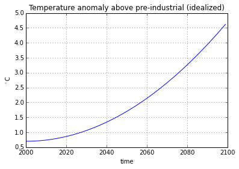
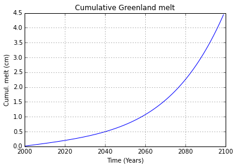
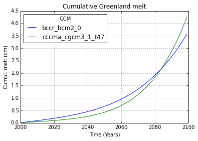

.. This file was generated automatically from the ipython notebook:
.. notebooks/dimarray_with_pandas.ipynb
.. To modify this file, edit the source notebook and execute "make rst"

.. _page_dimarray_with_pandas:

Working with dimarray and pandas
================================
:download:`Download notebook </notebooks/dimarray_with_pandas.ipynb>` 

.. _Reading_a_file_with_pandas_and_import_into_dimarray:

Reading a file with pandas and import into dimarray
---------------------------------------------------

The data represent fit of Greenland ice sheet melting as a function of global 
mean temperature, obtained from: http://www.met.rdg.ac.uk/~jonathan/data/ar4_ice_sheet_smb.html
(IPCC AR4, based on Gregory and Huybrechts, 2006, slightly outdated now but used here for the sake of the example)

>>> import numpy as np
>>> import pandas as pd
>>> import dimarray as da

Read data:

>>> datadir = da.get_datadir()+'/'
>>> df = pd.read_csv (datadir+'polyfits_greenland.dat', sep=" *", header=None, names=['a','b','c','GCM','HiRes'], skiprows=3)
>>> df.iloc[:8]  # display first 8 rows
         a        b        c                GCM            HiRes
0  0.00735  0.07831  0.03819        bccr_bcm2_0           ECHAM4
1  0.01111  0.05073  0.03384        bccr_bcm2_0           ECHAM5
2  0.00630  0.09292  0.04120        bccr_bcm2_0          HadAM3H
3  0.00635  0.12761  0.05857        bccr_bcm2_0  MIROC3.2(hires)
4  0.04127 -0.07570  0.06731  cccma_cgcm3_1_t47           ECHAM4
5  0.02733 -0.06201  0.04503  cccma_cgcm3_1_t47           ECHAM5
6  0.03029 -0.02258  0.05704  cccma_cgcm3_1_t47          HadAM3H
7  0.04510 -0.03558  0.08800  cccma_cgcm3_1_t47  MIROC3.2(hires)

.. raw:: html
     :file: dimarray_with_pandas_files/output_5-0.html

Two types of models are used: 18 general circulation models (coarse resolution, global domain) and 4 high-resulution regional models. 
Pandas' `set_index` method is convenient to "factorize" the data (but remains 2-D).

>>> df2 = df.set_index(['GCM','HiRes'])
>>> df2.columns.name = 'coef' # column name
>>> df2.ix[:8] # display first 8 rows
coef                                     a        b        c
GCM               HiRes                                     
bccr_bcm2_0       ECHAM4           0.00735  0.07831  0.03819
                  ECHAM5           0.01111  0.05073  0.03384
                  HadAM3H          0.00630  0.09292  0.04120
                  MIROC3.2(hires)  0.00635  0.12761  0.05857
cccma_cgcm3_1_t47 ECHAM4           0.04127 -0.07570  0.06731
                  ECHAM5           0.02733 -0.06201  0.04503
                  HadAM3H          0.03029 -0.02258  0.05704
                  MIROC3.2(hires)  0.04510 -0.03558  0.08800

.. raw:: html
     :file: dimarray_with_pandas_files/output_7-0.html

Convert to dimarray, pandas' multiindex is automatically converted to GroupedAxis (still 2-D data):

>>> a = da.DimArray.from_pandas(df2)
>>> a.ix[:8] # display first 8 rows
dimarray: 24 non-null elements (0 null)
0 / GCM,HiRes (8): ('bccr_bcm2_0', 'ECHAM4') to ('cccma_cgcm3_1_t47', 'MIROC3.2(hires)')
1 / coef (3): a to c
array([[ 0.00735,  0.07831,  0.03819],
       [ 0.01111,  0.05073,  0.03384],
       [ 0.0063 ,  0.09292,  0.0412 ],
       [ 0.00635,  0.12761,  0.05857],
       [ 0.04127, -0.0757 ,  0.06731],
       [ 0.02733, -0.06201,  0.04503],
       [ 0.03029, -0.02258,  0.05704],
       [ 0.0451 , -0.03558,  0.088  ]])

Expand the array with the "ungroup" command, to convert it to 3-D data

>>> a3d = a.ungroup()
>>> a3d
dimarray: 216 non-null elements (0 null)
0 / GCM (18): bccr_bcm2_0 to ukmo_hadgem1
1 / HiRes (4): ECHAM4 to MIROC3.2(hires)
2 / coef (3): a to c
array(...)

.. _Write_generic_function_using_dimarray's_axis_naming:

Write generic function using dimarray's axis naming
---------------------------------------------------

>>> def projection(T, params):
...     """ project Greenland melting based on global mean temperature
...     T: dimarray representing global mean temperature anomaly, must have 'time' dimension
...     params: fit parameters as defined above (dimarray), must have 'coef' dimension
...     """
...     a, b, c = params.swapaxes(0, 'coef') # coef as first dimension, then distribute into a, b, c
...     meltrate = a + b*T + c*T**2
...     cummelt = meltrate.cumsum(axis='time') * 0.1 # mm/yr ==> cm
...     return cummelt

.. _First_example_using_single_temperature_curve:

First example using single temperature curve
^^^^^^^^^^^^^^^^^^^^^^^^^^^^^^^^^^^^^^^^^^^^

>>> %pylab # doctest: +SKIP 
>>> %matplotlib inline # doctest: +SKIP 

Using matplotlib backend: Qt4Agg
Populating the interactive namespace from numpy and matplotlib

>>> # Say projected temperature is a quadratic increase over time
>>> time = np.arange(2000, 2100)
>>> T = 0.7 + (0.02*(time-2000))**2
>>> T = da.array(T, axes=('time', time))
>>> T.plot() # plot using underlying pandas method (T.to_pandas().plot())
>>> title("Temperature anomaly above pre-industrial (idealized)")
>>> ylabel("$^\circ$C") # doctest: +SKIP
<matplotlib.text.Text at 0x7ff4f412e390>

>>> da.rcParams['display.max'] = 100 # max display : 100 (back to default)
>>> melt = projection(T, params=a3d)
>>> melt
dimarray: 7200 non-null elements (0 null)
0 / HiRes (4): ECHAM4 to MIROC3.2(hires)
1 / GCM (18): bccr_bcm2_0 to ukmo_hadgem1
2 / time (100): 2000 to 2099
array(...)

>>> meanmelt = melt.mean(axis=('GCM','HiRes')) # average over two dimensions
>>> meanmelt.plot()
>>> title('Cumulative Greenland melt')
>>> xlabel('Time (Years)')
>>> ylabel('Cumul. melt (cm)') # doctest: +SKIP
<matplotlib.text.Text at 0x7ff4f422d5d0>

.. _More_advanced_example_with_multi-dimensional_input:

More advanced example with multi-dimensional input
^^^^^^^^^^^^^^^^^^^^^^^^^^^^^^^^^^^^^^^^^^^^^^^^^^

Define dummy temperature curve representing two climate models, use stack function to join a dictionary of DimArrays

>>> T2 = da.stack ({'bccr_bcm2_0':T*0.9, 'cccma_cgcm3_1_t47': T*1.2}, axis='GCM')
>>> T2
dimarray: 200 non-null elements (0 null)
0 / GCM (2): cccma_cgcm3_1_t47 to bccr_bcm2_0
1 / time (100): 2000 to 2099
array(...)

Projection automatically reindexes the 'GCM' dimension before operation is performed, missing GCMs replaced by NaN (therefore 6400 NaN values)

>>> melt2 = projection(T2, params=a3d)
>>> melt2 
dimarray: 800 non-null elements (6400 null)
0 / HiRes (4): ECHAM4 to MIROC3.2(hires)
1 / GCM (18): bccr_bcm2_0 to ukmo_hadgem1
2 / time (100): 2000 to 2099
array(...)

Remove NaN values (only the two GCMs remain):

>>> melt2 = melt2.dropna(axis='GCM')  # drop missing GCMs
>>> melt2
dimarray: 800 non-null elements (0 null)
0 / HiRes (4): ECHAM4 to MIROC3.2(hires)
1 / GCM (2): bccr_bcm2_0 to cccma_cgcm3_1_t47
2 / time (100): 2000 to 2099
array(...)

Average over High-resolution regional models and plot:

>>> meanmelt2 = melt2.mean(axis='HiRes') # average over two dimensions
>>> meanmelt2.T.plot() # transpose before plotting to have time as first dimension
>>> title('Cumulative Greenland melt')
>>> xlabel('Time (Years)')
>>> ylabel('Cumul. melt (cm)') # doctest: +SKIP
<matplotlib.text.Text at 0x7ff4f41edc10>

