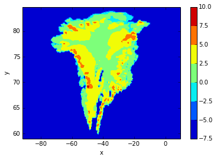
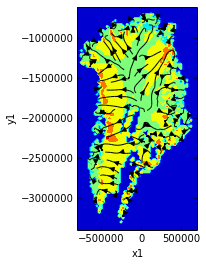
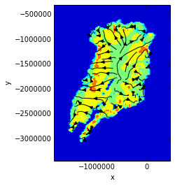

.. This file was generated automatically from the ipython notebook:
.. notebooks/projection.ipynb
.. To modify this file, edit the source notebook and execute "make rst"

.. _page_projection:

.. _projection:

Coordinate systems and Projections
==================================
:download:`Download notebook </notebooks/projection.ipynb>` 

.. versionadded:: 0.1.9

.. contents::
    :local:

dimarray.geo is shipped with :func:`dimarray.geo.transform` and :func:`dimarray.geo.transform_vectors` functions to handle transformations across coordinate reference systems. They are based on `cartopy.crs` methods, themselves built on `PROJ.4` library.

In contrast to cartopy/PROJ.4, dimarray.geo functions perform both coordinate transforms and regridding onto a regular grid in the new coordinate system. This is because of the structure of DimArray and GeoArray classes, which only accept regular grids (in the sense of a collection of 1-D axes).

.. _Coordinate_systems__CF-conventions,_PROJ.4,_cartopy:

Coordinate systems: CF-conventions, PROJ.4, cartopy
---------------------------------------------------

A typical software to make projections is PROJ.4. Python bindings exist, such as pyproj. One problem is that PROJ.4 parameters differ from those present in the netCDF file.

The grid mapping attributes in netCDF files are defined according to a set of `CF conventions <http://cfconventions.org/Data/cf-convetions/cf-conventions-1.7/build/cf-conventions.html#appendix-grid-mappings>`_. Following the indications in this document, and given some understanding of the underlying projection, it is not too difficult to find the matching PROJ.4 parameters.

A good understanding may still require a bit of time, though. And when it comes to plotting this may not be enough ! basemap is actually pretty close to PROJ.4 in term of parameter names (but not one to one) so the PROJ.4 to basemap step is small. Other tools, like the younger `cartopy <http://scitools.org.uk/cartopy/>`_ introduces its own parameter names, which are also slightly different from those introduced by another sister project from the Met' Office, `iris <http://scitools.org.uk/iris/>`_. Note that under the hood both projects use cartopy's own bindings to PROJ.4.  

:mod:`dimarray.geo.crs` attempts to ease mapping between CF-convention and PROJ.4 parameters by defining a few common projection classes. These classes inherit from the generic class :class:`cartopy.crs.CRS`, but are not limited to the projection list defined by cartopy (which add another layer on top of PROJ.4 / CRS to help plotting). In fact, the :class:`dimarray.geo.crs.Proj4` class can be initialized by any PROJ.4 string.

.. note :: Why cartopy and not just pyproj? Pyproj would be just fine, and is more minimalistic, but cartopy also implements vector transformas and offers other useful features related to plotting, reading shapefiles, download online data and so on, which come in handy. Moreover it feels more `"pythonic" <http://legacy.python.org/dev/peps/pep-0008>`_, is actively developed with support from the Met' Office, and is related to another interesting project, iris. It builds on other powerful packages such as shapely and it feels like in the long (or not so long) run it might grow toward something even more useful.

.. _A_practical_example:

A practical example
-------------------

.. _Explore_the_data:

Explore the data
^^^^^^^^^^^^^^^^

>>> from pylab import *  # %pylab would break the doctest
>>> %matplotlib inline # doctest: +SKIP 
>>> from dimarray.geo import GeoArray, get_ncfile, read_nc

Let's use a real-world example of surface velocity data from Joughin et al (2010) (see exact reference below), sub-sampled at lower resolution for testing purposes.

>>> ncfile = get_ncfile('greenland_velocity.nc')
>>> ds = read_nc(ncfile)
>>> #print ds.summary()
>>> ds
Dataset of 6 variables
0 / y1 (113): -3400000.0 to -600000.0
1 / x1 (61): -800000.0 to 700000.0
surfvelmag: ('y1', 'x1')
lat: ('y1', 'x1')
lon: ('y1', 'x1')
surfvely: ('y1', 'x1')
surfvelx: ('y1', 'x1')
mapping: nan

"lon" and "lat" are not the standard coordinates here. But "x1" and "y1". Let's have a closer look:

>>> print ds.axes.summary()
0 / y1 (113): -3400000.0 to -600000.0
        units : meters
        long_name : Cartesian y-coordinate
        standard_name : projection_y_coordinate
1 / x1 (61): -800000.0 to 700000.0
        units : meters
        long_name : Cartesian x-coordinate
        standard_name : projection_x_coordinate

They are obviously projection coordinates. 2-dimensional longitude and latitude coordinates are also present in the dataset.

Examining closer the attributes of 'surfvelmag' variable, a "grid_mapping" attribute is present:

>>> ds['surfvelmag']._metadata() # doctest: +SKIP
{'grid_mapping': u'mapping',
 'long_name': u'Surface Velocity Magnitude',
 'note': u'Ian Joughin notes that "Having any papers that use the data we provided to searise cite this paper [the reference provided] gives us something we can track through ISI and report to NASA to satisfy their metrics requirements, which is a necessary evil to ensure continued production of such data sets.  So ... any publication of results based on this data should cite the above paper."',
 'reference': u'Joughin I., Smith B.E., Howat I.M., Scambos T., Moon T., "Greenland flow variability from ice-sheet wide velocity mapping", JGlac 56(197), 2010.',
 'units': u'meters/year'}

"grid_mapping" is a string which points to another variable in the dataset, here "mapping". This is according to CF-conventions. *mapping* is a dummy variable whose attributes contain the information needed to define a coordinate reference system. 

>>> grid_mapping = ds['mapping']._metadata()
>>> grid_mapping # doctest: +SKIP
{'ellipsoid': u'WGS84',
 'false_easting': 0.0,
 'false_northing': 0.0,
 'grid_mapping_name': u'polar_stereographic',
 'latitude_of_projection_origin': 90.0,
 'standard_parallel': 71.0,
 'straight_vertical_longitude_from_pole': -39.0}

We can use matplotlib's contourf to get a feeling for what that all mean. Below using regular x1, y1 grid, in the projection plane.

>>> v = ds['surfvelmag']  # velopcity magnitude
>>> h = log(clip(v,1e-3,inf)).contourf() # logarithm of velocity
>>> colorbar(h)  # doctest: +SKIP
>>> ax = gca() # get plot axis
>>> ax.set_aspect('equal') # equal aspect ratio
>>> ax.set_xticks([-500e3,0,500e3]) # ticks every 500 km  # doctest: +SKIP

And now plotting versus lon and lat (irregular, 2-D grid in this case):

>>> contourf(ds['lon'], ds['lat'], log(clip(v, 1e-3,inf))); colorbar()  # doctest: +SKIP
<matplotlib.colorbar.Colorbar instance at 0x7f93239891b8>

The polar stereographic projection (top) represent real distances in kilometers because points are projected on a plane close to the region of interest (Greenland).  In the longitude / latitude (or geodetic) (bottom) coordinate system horizontal distances are exagerated toward the pole. This is clearly visible on this figure. 

.. _Grid_mapping_to_CRS_class:

Grid mapping to CRS class
^^^^^^^^^^^^^^^^^^^^^^^^^

The :func:`get_crs` function returns the most adequate projection class:

>>> from dimarray.geo.crs import get_crs

>>> stere = get_crs(grid_mapping)
>>> stere # doctest: +SKIP
<dimarray.geo.crs.PolarStereographic at 0x7f9323af8410>

All projection classes defined in dimarray inherit from :class:cartopy.crs.CRS. A few common transformations have a Cartopy equivalent, and are defined as subclass, where possible.

>>> import cartopy.crs as ccrs
>>> isinstance(stere, ccrs.Stereographic)
True

>>> stere.transform_point(-40,71,ccrs.PlateCarree()) # project lon=-40 lat=71 (longlat coordinates) onto our coord system
(-36349.17592524537, -2082442.8940927587)

So that it is also possible to directly provide a cartopy class (for user more familiar with cartopy than with CF-conventions). Note also that any such class has a :attr:`proj4_init` attribute (see cartopy's doc and source code) which is passed to PROJ.4 when performing the actual transformations:

>>> stere.proj4_init
'+ellps=WGS84 +proj=stere +lat_0=90.0 +lon_0=-39.0 +x_0=0.0 +y_0=0.0 +lat_ts=71.0 +no_defs'

In some cases they are no cartopy pre-defined classes, nor dimarray. If you figure out which PROJ.4 parameters should be used, it is possible to initialize a :class:dimarray.geo.crs.Proj4 class with a PROJ.4 string, still as a subclass of cartopy's CRS. 

>>> from dimarray.geo.crs import Proj4
>>> stere2 = Proj4("+ellps=WGS84 +proj=stere +lat_0=90.0 +lon_0=-39.0 +x_0=0.0 +y_0=0.0 +lat_ts=71.0")
>>> stere2.transform_point(-40,71,ccrs.PlateCarree())
(-36349.17592524537, -2082442.8940927587)

The :func:`dimarray.geo.get_crs` function takes these various conventions and return the matching CRS instance. 

.. _Transform_dimarrays:

Transform dimarrays
^^^^^^^^^^^^^^^^^^^

Let's do our first transformation with diamrray and cartopy

>>> from dimarray.geo import transform

>>> v = ds['surfvelmag']
>>> vt = transform(v, from_crs=stere, to_crs=ccrs.PlateCarree())
>>> vt
geoarray: 6893 non-null elements (0 null)
0 / y (113): 58.6292691402 to 84.4819014732 (Y)
1 / x (61): -92.1301023542 to 10.398705355 (X)
array(...)

The coordinates are quite messy, let's do something better by providing the final domain.

>>> vt = transform(v, from_crs=stere, to_crs=ccrs.PlateCarree(), xt=np.arange(-92,10,0.25), yt=np.arange(59,85,0.25))
>>> vt
geoarray: 42432 non-null elements (0 null)
0 / y (104): 59.0 to 84.75 (Y)
1 / x (408): -92.0 to 9.75 (X)
array(...)

.. note :: If xt and yt are not provided, they are determined by a forward transformation of the (meshed) original coordinates onto the new coordinate system and by building a regular grid from the transformed (irregular) coordinates. In any case, xt and yt then need to be mapped back into the original coordinate system, where the dimarray is interpolated. For that reason, it is preferable to provide xt and yt, so that only one (backward !) transformation is performed.

Double-check against earlier figures, this looks all right:

>>> h = log(clip(vt,1e-3,inf)).contourf(levels=np.linspace(-7.5, 10, 8))  # doctest: +SKIP
>>> colorbar(h) # doctest: +SKIP
<matplotlib.colorbar.Colorbar instance at 0x7f9322975dd0>

So in summary transformations between coordinate reference systems are performed using cartopy's CRS subclasses. The result is always a regular dimarray.

.. _Transform_vector_fields:

Transform vector fields
^^^^^^^^^^^^^^^^^^^^^^^

It is also possible to perform vector transformation (wrapper around :meth:`cartopy.crs.CRS.transform_vectors` method)

That is the original field on the projection plane.

>>> vx = ds['surfvelx']
>>> vy = ds['surfvely']
>>> log(clip(v,1e-3,inf)).contourf()   # doctest: +SKIP
>>> streamplot(vx.x1, vx.y1, vx.values, vy.values, color='k')   # doctest: +SKIP
>>> ax = gca()
>>> ax.set_aspect('equal') # equal aspect ratio
>>> ax.set_xticks([-500e3,0,500e3]) # ticks every 500 km  # doctest: +SKIP

Transforming vectors in longitude latitude coordinates does not make much sense because the angles cannot be conserved. Let's rather use a polar stereographic projection focused on the north-east side of Greenland.

>>> grid_mapping = {'ellipsoid': 'WGS84',
...   'grid_mapping_name': 'polar_stereographic',
...   'latitude_of_projection_origin': 90.0, # +90 or -90 are accepted with this class 
...   'standard_parallel': 71.0,
...   'straight_vertical_longitude_from_pole': -20}
>>> 
>>> stere_ne = get_crs(grid_mapping)

.. note:: A stereographic projection would achieve similar result with parameters {'longitude_of_projection_origin':-20, 'latitude_of_projection_origin': 78.0} and further adjustment of 'false_northing'. While a stereographic projection uses a plane tangent to the Earth surface at the specified point, a polar_stereographic always uses a plane parallel to the equator, but secant to the Earth surface along the standard_parallel, where the deformation between distances on the plane and on the ellipsoid is minimal. See `cartopy issue #455 <https://github.com/SciTools/cartopy/issues/455>`_ for more discussion. 

>>> from dimarray.geo import transform_vectors

>>> vt = transform(v, from_crs=stere, to_crs=stere_ne)
>>> vxt, vyt = transform_vectors(vx,vy, from_crs=stere, to_crs=stere_ne)
>>> 
>>> log(clip(vt,1e-3,inf)).contourf()   # doctest: +SKIP
>>> streamplot(vxt.x, vxt.y, vxt.values, vyt.values, color='k')   # doctest: +SKIP
>>> 
>>> ax = gca()
>>> ax.set_aspect('equal') # equal aspect ratio
>>> ax.set_xticks([-1000e3,0]) # ticks every 1000 km  # doctest: +SKIP

.. note:: The rotation is due to changing the straight longitude from pole. At x=0 north-south features lie along the y axis, whereas elsewhere they appear rotated. As far as distances are concerned, the standard parellel specification indicates the latitude at which there is no distorsion compared to the ellipsoid surface.