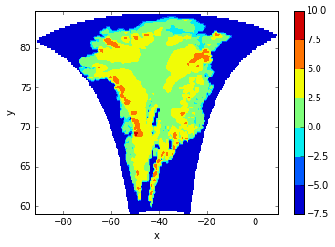

.. This file was generated automatically from the ipython notebook:
.. notebooks/projection.ipynb
.. To modify this file, edit the source notebook and execute "make rst"

.. _page_projection:

.. _projection:

Coordinate reference systems and Projections
============================================
:download:`Download notebook </notebooks/projection.ipynb>` 

.. contents::
    :local:

dimarray.geo is shipped with :func:`dimarray.geo.transform` and :func:`dimarray.geo.transform_vectors` functions to handle transformations across coordinate reference systems. It is based on `cartopy.crs` methods, itself built on `PROJ.4` library.

In contrast to cartopy/PROJ.4, dimarray.geo functions perform both coordinate transforms and regridding onto a regular grid in the new coordinate system. This is because of the structure of DimArray and GeoArray classes, which only accept regular grids (in the sense of a collection of 1-D axes).

.. _A_practical_example:

A practical example
-------------------

>>> from dimarray.geo import GeoArray, get_ncfile, read_nc

Let's use a real-world example of surface velocity data from Joughin et al (2010) (see exact reference below), sub-sampled at lower resolution for testing purposes.

>>> ncfile = get_ncfile('greenland_velocity.nc')
>>> ds = read_nc(ncfile)
>>> #print ds.summary()
>>> ds
Dataset of 6 variables
0 / y1 (113): -3400000.0 to -600000.0
1 / x1 (61): -800000.0 to 700000.0
surfvelmag: ('y1', 'x1')
lat: ('y1', 'x1')
lon: ('y1', 'x1')
surfvely: ('y1', 'x1')
surfvelx: ('y1', 'x1')
mapping: nan

"lon" and "lat" are not the standard coordinates here. But "x1" and "y1". Let's have a closer look:

>>> print ds.axes.summary()
0 / y1 (113): -3400000.0 to -600000.0
        units : meters
        long_name : Cartesian y-coordinate
        standard_name : projection_y_coordinate
1 / x1 (61): -800000.0 to 700000.0
        units : meters
        long_name : Cartesian x-coordinate
        standard_name : projection_x_coordinate

They are obviously projection coordinates. Examining closer the attributes of 'surfvelmag' variable, a "grid_mapping" attribute is present:

>>> ds['surfvelmag']._metadata()
{'grid_mapping': u'mapping',
 'long_name': u'Surface Velocity Magnitude',
 'note': u'Ian Joughin notes that "Having any papers that use the data we provided to searise cite this paper [the reference provided] gives us something we can track through ISI and report to NASA to satisfy their metrics requirements, which is a necessary evil to ensure continued production of such data sets.  So ... any publication of results based on this data should cite the above paper."',
 'reference': u'Joughin I., Smith B.E., Howat I.M., Scambos T., Moon T., "Greenland flow variability from ice-sheet wide velocity mapping", JGlac 56(197), 2010.',
 'units': u'meters/year'}

"grid_mapping" is a string which points to another variable in the dataset, here "mapping". This is according to CF-conventions. *mapping* is a dummy variable whose attributes contain the information needed to define a coordinate reference system. 

>>> grid_mapping = ds['mapping']._metadata()
>>> grid_mapping
{'ellipsoid': u'WGS84',
 'false_easting': 0.0,
 'false_northing': 0.0,
 'grid_mapping_name': u'polar_stereographic',
 'latitude_of_projection_origin': 90.0,
 'standard_parallel': 71.0,
 'straight_vertical_longitude_from_pole': -39.0}

.. _Coordinate_reference_system_and_the_programmer's_headache:

Coordinate reference system and the programmer's headache
---------------------------------------------------------

These attributes are defined according to a set of (`CF conventions <http://cfconventions.org/Data/cf-convetions/cf-conventions-1.7/build/cf-conventions.html#appendix-grid-mappings>`_). Following the indications in the CF-convention document, and given some understanding of the underlying projection, it should be possible to map the meaning of the CF parameters onto the meaning PROJ.4 parameters (a widely-used software to make coordinate projections). 

A good understanding may still require a bit of time, though. And sometimes you have to deal with various softwares, e.g. for plotting. To complicate things a little more, a handy python binding around PROJ.4 (among other things), `cartopy <http://scitools.org.uk/cartopy/>`_ introduces its own parameter names, which are also slightly different from those introduced by another sister project from the Met' Office, `iris <http://scitools.org.uk/iris/>`_. 

:module:dimarray.geo.crs offers a few functions to ease mapping of parameters between CF names and PROJ.4 (work in progress !).

>>> from dimarray.geo.crs import get_crs

>>> crs = get_crs(grid_mapping)
>>> crs
<dimarray.geo.crs.PolarStereographic at 0x7f31224fb590>

All projection classes defined in dimarray inherit from :class:cartopy.crs.CRS. 

>>> import cartopy.crs as ccrs
>>> isinstance(crs, ccrs.Stereographic)
True

>>> crs.transform_point(-40,71,ccrs.Geodetic()) # project lon=-40 lat=71 (geodetic coordinates) onto our coord system
(-36349.17592565123, -2082442.894090307)

So that it is also possible to directly provide a cartopy class (for user more familiar with cartopy than with CF-conventions). Note also that any such class has a :attr:`proj4_init` attribute (see cartopy's doc and source code) which is passed to PROJ.4 when performing the actual transformations:

>>> crs.proj4_init
'+ellps=WGS84 +proj=stere +lat_0=90.0 +lon_0=-39.0 +x_0=0.0 +y_0=0.0 +lat_ts=71.0 +no_defs'

In some cases they are no cartopy pre-defined classes, nor dimarray. If you figure out which PROJ.4 parameters should be used, it is possible to initialize a :class:dimarray.geo.crs.Proj4 class with a PROJ.4 string, still as a subclass of cartopy's CRS. 

>>> from dimarray.geo.crs import Proj4
>>> crs2 = Proj4("+ellps=WGS84 +proj=stere +lat_0=90.0 +lon_0=-39.0 +x_0=0.0 +y_0=0.0 +lat_ts=71.0")
>>> crs2.transform_point(-40,71,ccrs.Geodetic())
(-36349.17592565123, -2082442.894090307)

The :func:`dimarray.geo.get_crs` function takes these various conventions and return the matching CRS instance. 

.. _Transform_dimarrays:

Transform dimarrays
-------------------

Let's do our first transformation with diamrray and cartopy

>>> from dimarray.geo.projection import transform, transform_vectors

>>> v = ds['surfvelmag']
>>> vt = transform(v, from_grid_mapping=crs, to_grid_mapping=ccrs.Geodetic())
>>> vt
geoarray: 6893 non-null elements (0 null)
0 / lat (113): 58.6292691402 to 84.4819014732 (Latitude)
1 / lon (61): -92.1301023542 to 10.398705355 (Longitude)
array(...)

The coordinates are quite messy, let's do something better by oroviding the final domain.

>>> import numpy as np

>>> #vt = transform(v, from_grid_mapping=crs, to_grid_mapping=ccrs.Geodetic(), xt=np.arange(-60,10), yt=np.arange(55,85))
>>> #vt

And let's check the results

>>> %pylab # doctest: +SKIP 
>>> %matplotlib inline # doctest: +SKIP 

Using matplotlib backend: Qt4Agg
Populating the interactive namespace from numpy and matplotlib

Projection plane (from file)

>>> h = log(v.clip(1e-3,inf)).contourf()
>>> colorbar(h) # doctest: +SKIP
<matplotlib.colorbar.Colorbar instance at 0x7f3115e38d40>

.. image:: projection_files/figure_36-1.png

Lon / lat coord system (from file)

>>> contourf(ds['lon'], ds['lat'], log(v.clip(1e-3,inf))); colorbar() # doctest: +SKIP
<matplotlib.colorbar.Colorbar instance at 0x7f3115c7d320>

.. image:: projection_files/figure_38-1.png

Lon / lat coord system as transformed by dimarray

>>> h = log(vt.clip(1e-3,inf)).contourf()
>>> colorbar(h) # doctest: +SKIP
<matplotlib.colorbar.Colorbar instance at 0x7f3115c03680>

