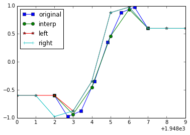

.. This file was generated automatically from the ipython notebook:
.. notebooks/reindexing.ipynb
.. To modify this file, edit the source notebook and execute "make rst"

.. _page_reindexing:

Reindexing: align axes
======================
:download:`Download notebook </notebooks/reindexing.ipynb>` 

Reindexing is the action of shrinking or extending an array to match a new index, in some ways similar to interpolation, except that by default, the new index has to be present, or it is filled with NaN. Actual interpolation is performed by passing `method="nearest"` or `method="interp"` parameter.

.. _reindex_axis:

reindex_axis
^^^^^^^^^^^^

>>> from dimarray import DimArray
>>> a = DimArray([3,4],[('x0',[1,3])])
>>> a.reindex_axis([1,2,3])
dimarray: 2 non-null elements (1 null)
0 / x0 (3): 1 to 3
array([  3.,  nan,   4.])

Also works with string indices

>>> b = DimArray([1,2,3],[('x0', ['a','b','c'])])
>>> b.reindex_axis(['b','d'])
dimarray: 1 non-null elements (1 null)
0 / x0 (2): 'b' to 'd'
array([  2.,  nan])

It is possible to fill the missing values with the preceding, or following values of the sorted array (see numpy.searchsorted for more ample documentation):

See :meth:`dimarray.DimArray.reindex_axis`

>>> b.reindex_axis(['b','d'], method='left')
dimarray: 2 non-null elements (0 null)
0 / x0 (2): 'b' to 'd'
array([2, 3])

>>> b.reindex_axis(['b','d'], method='right')
dimarray: 2 non-null elements (0 null)
0 / x0 (2): 'b' to 'd'
array([3, 3])

.. _reindex_like:

reindex_like
^^^^^^^^^^^^

Same as reindex_axis, except that the new axes are searched for in another array.

>>> c = DimArray([[1,2,3], [4,5,6]],[('x0',["a","b"]),('x1',[1, 2, 3])])
>>> c.reindex_like(b)
dimarray: 6 non-null elements (3 null)
0 / x0 (3): 'a' to 'c'
1 / x1 (3): 1 to 3
array([[  1.,   2.,   3.],
       [  4.,   5.,   6.],
       [ nan,  nan,  nan]])

See :meth:`dimarray.DimArray.reindex_like`

.. _Interpolation:

Interpolation
^^^^^^^^^^^^^

Sometimes you do not want one-to-one re-indexing but interpolation. Use the `DimArray.interp_axis` method for linear, piecewise interpolation (wrapper around np.interp)

>>> a.interp_axis([0,1,2,3])
dimarray: 3 non-null elements (1 null)
0 / x0 (4): 0 to 3
array([ nan,  3. ,  3.5,  4. ])

>>> import numpy as np
>>> time=np.linspace(1950,1955,8)
>>> v = DimArray(np.cos(time), axes=('time',time))
>>> #w = v.reindex_axis(np.linspace(1948,1957,10), axis='time', method='interp')
>>> xl = v.reindex_axis(np.linspace(1948,1957,10), axis='time', method='left')
>>> xr = v.reindex_axis(np.linspace(1948,1957,10), axis='time', method='right')
>>> w = v.interp_axis(np.linspace(1948,1957,10), axis='time')

>>> import matplotlib.pyplot as plt
>>> %matplotlib inline # doctest: +SKIP 
>>> plt.clf()  # doctest: +SKIP
>>> plt.plot(v.time, v.values, 's-', label='original')  # doctest: +SKIP
>>> plt.plot(w.time, w.values, 'o-', label='interp')  # doctest: +SKIP
>>> #plt.plot(w1.time, w.values, 'o--', color='k', label='interp')
>>> plt.plot(xl.time, xl.values, '*-',label='left') # doctest: +SKIP
>>> plt.plot(xr.time, xr.values, '+-',label='right') # doctest: +SKIP
>>> plt.legend(loc='upper left')   # doctest: +SKIP
<matplotlib.legend.Legend at 0x7fe5a780f090>

.. _align:

align
^^^^^

It is also possible to proceed to axis alignment on a sequence of arrays

>>> # align axes
>>> from dimarray import align
>>> x = DimArray([1,2,3],('x0',[1,2,3]))
>>> y = DimArray([3,4],('x0',[2,4]))
>>> xa, ya = align(x, y)
>>> ya
dimarray: 2 non-null elements (2 null)
0 / x0 (4): 1 to 4
array([ nan,   3.,  nan,   4.])

See :func:`dimarray.align`